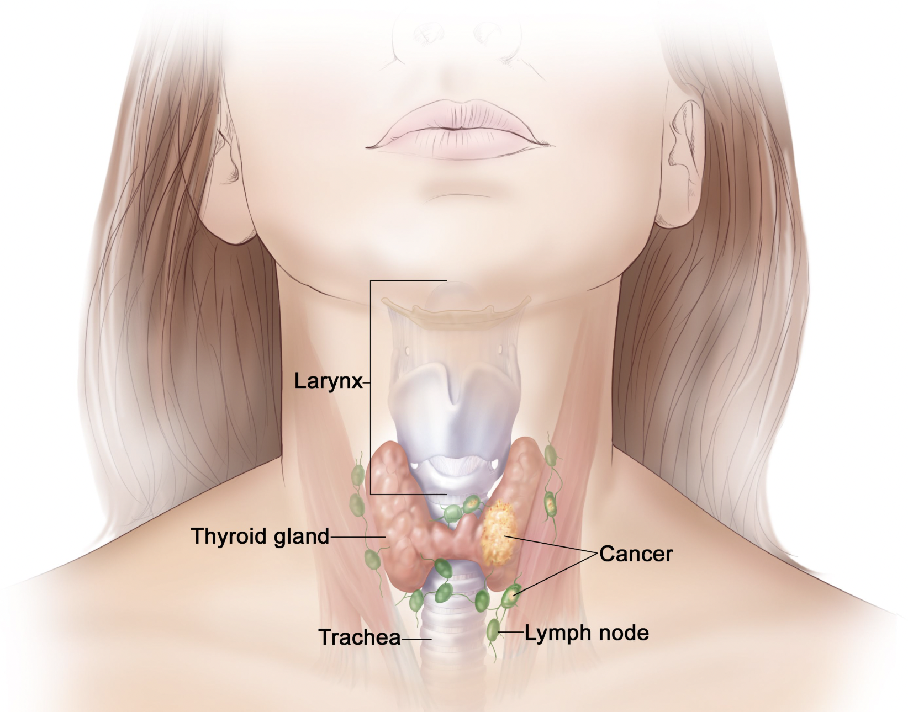

# Thyroid Nodule Malignancy Classification with Machine Learning

  

## 📄 Overview
Thyroid nodules are common clinical findings, and distinguishing benign from malignant nodules is critical for early diagnosis and treatment. This project applies **machine learning techniques** to predict thyroid nodule malignancy based on clinical ultrasound and laboratory features.  

The analysis demonstrates an end-to-end pipeline including **data preprocessing, feature selection, model training, evaluation, and visualization**. Models include **K-Means Clustering, Random Forest Classifier, and Neural Network (MLPClassifier)**.

---

## 🧰 Technologies Used
- **Languages:** Python  
- **Libraries & Tools:** Pandas, NumPy, Matplotlib, Seaborn, scikit-learn, Plotly, SHAP  
- **ML Models:** K-Means Clustering, Random Forest, Neural Network  
- **Other:** Jupyter Notebook / Google Colab

---

## 🗂️ Dataset
- **Source:** Clinical ultrasound and laboratory data of thyroid nodules  
- **Features:** Shape, Calcification, Echo Pattern, Size, Composition, Margin  
- **Goal:** Predict whether a thyroid nodule is benign or malignant  

---

## 🚀 Workflow
1. **Data Preprocessing:**  
   - Imported, normalized, and standardized clinical features  
   - Removed non-essential identifiers (e.g., patient ID)  
   - Addressed feature scaling for proper convergence  

2. **Feature Selection:**  
   Clinically relevant features were chosen for modeling:  

   | Feature      | Type       | Description |
   |-------------|------------|-------------|
   | Shape       | Binary     | Irregular shapes indicate malignancy |
   | Calcification | Binary   | Microcalcifications are strong cancer indicators |
   | Echo Pattern | Binary    | Uneven texture (hypoechoic) correlates with malignancy |
   | Size        | Continuous | Larger nodules tend to be more suspicious |
   | Composition | Categorical | Solid nodules carry higher malignancy risk |
   | Margin      | Binary     | Irregular margins imply invasive growth |

3. **Machine Learning Models:**  
   - **K-Means Clustering:** Unsupervised clustering (k=2) with evaluation via ARI and silhouette score.  
   - **Random Forest Classifier:** Supervised ensemble model with feature importance ranking.  
   - **Neural Network (MLPClassifier):** Two hidden layers, logistic activation, Adam optimizer, L2 regularization.

4. **Evaluation Metrics:**  
   - Accuracy  
   - ROC-AUC  
   - Precision, Recall, F1-Score  
   - Confusion Matrix and feature importance visualization  

---

## 📊 Model Performance

### Classification Results

| Model             | Accuracy  | ROC AUC  | F1 Score | Precision | Recall |
|------------------|-----------|----------|----------|-----------|--------|
| Neural Network    | 0.7611    | 0.8332   | 0.8249   | 0.8742    | 0.7809 |
| Random Forest     | 0.6316    | 0.7721   | 0.7407   | 0.7514    | 0.7303 |
| K-Means           | 0.3628    | N/A      | 0.4965   | 0.5230    | 0.4725 |

**Insights:**  
- Neural Network achieves the best predictive performance with strong ROC-AUC and balanced classification metrics.  
- Random Forest provides high interpretability with feature importance while performing robustly.  
- K-Means clustering shows moderate alignment with malignancy labels, useful for unsupervised exploration.  

---

## 📈 Visualization Highlights
- **Elbow Plot & Silhouette Analysis:** Cluster validation for K-Means  
- **Confusion Matrices:** Insight into classification accuracy and misclassifications  
- **Feature Importance Graphs:** Interpretability for Random Forest  
- **ROC & Precision-Recall Curves:** Model evaluation  
- **3D Interactive Plots (Plotly):** Exploration of feature relationships  

---

## 🔍 Key Insights
- Clinically relevant features **shape, calcification, and margin** are the strongest indicators of malignancy.  
- Both Neural Network and Random Forest outperform unsupervised clustering, achieving high accuracy and robust predictive power.  
- This project demonstrates an end-to-end **data-driven approach to thyroid malignancy classification**.

---

## 📂 Repository Structure
- `data/` → Dataset description and metadata  
- `notebooks/` → Jupyter Notebooks with preprocessing, analysis, and modeling  
- `visuals/` → Plots and figures for exploration and evaluation  
- `README.md` → Project overview and results  

---

✨ *Applying machine learning to empower clinical decision-making and enhance early diagnosis.*
